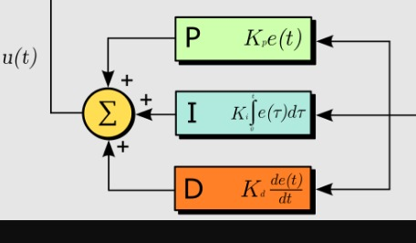
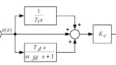
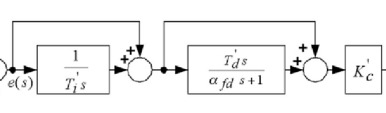
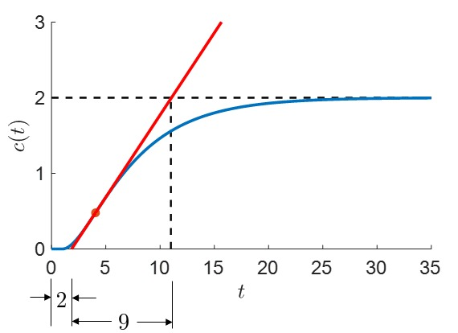
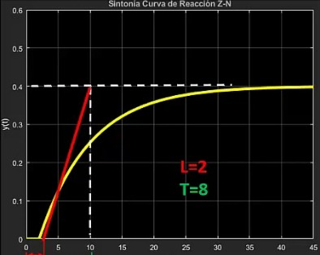

# Sintonizacion PID en lazo abierto
Angel David Melo, Daniel Felipe Ladino 

La sintonización de controladores PID es un proceso fundamental en el área de control. Esto se usa para asegurar que un sistema responda de forma estable y eficiente ante perturbaciones o cabios en las condiciones de operación.

El método de sintonización en lazo abierto se basa en desconectar temporalmente el lazo de control y aplicar una señal (usualmente de tipo escalón) de entrada al sistema para observar su respuesta y a partir de esta se obtienen características del circuito que serán claves como el tiempo de retardo, la ganancia estática y las constantes del tiempo. 
Estos parámetros servirán para construir un modelo aproximado del sistema, y basándose en el modelo se utilizan metodologías empíricas de sintonización como el método Ziegler-Nichols o Choen-Coon que proporcionan formulas específicas para calcular los valores óptimos de las constantes para el controlador PID.

Este tipo de sintonización ofrece simplicidad, bajo riesgo de inestabilidad durante el proceso de ajuste y tiene la posibilidad de aplicarse a sistemas que operan de manera continua.

## controladores PID
Sus orígenes datan desde 1922 donde Nicolas Minorski realizo el análisis de este tipo de controladores. Su trabajo surgió a partir de la necesidad de automatizar el sistema de dirección de barcos de guerra. En medio de esto formulo por primera vez un modelo matemático que incorporaba tres acciones fundamentales: proporcional, integral y derivativa.

Posteriormente en 1936 la idea de un controlador de tres términos de propósito general con una acción de control variable. es decir, capaz de ser ajustado y aplicado a distintos tipos de sistemas comenzó a tomar forma. sin embargo, no fue introducido en su totalidad hasta finales de la década de 1930 donde se integró en aplicaciones prácticas.
Este avance represento un hito importante en el campo del control automático permitiendo el diseño de sistemas más versátiles, robustos y adaptables a diferentes condiciones.

## Acciones de control
Para poder entender estos controladores debemos tener en cuenta las siguientes caracteristicas:

-La accion proporcioanl es util en los problemas en las que unicamnete se quiere modificar uno de los parametros del sistema.

-Si se requiere manejar mas de un objetivo es adecuado utilizar varias acciones de control.

-Un control normalmente no tiene accion proporcional, en vez de esto tiene una funcion de transferencia que contiene las acciones de control.
Las acciones de control que existen son:

## Accion proporcional
La acción proporcional es la parte más directa y fundamental del controlador PID. Esta sección toma el valor del error t lo multiplica por una constante proporcional.
El trabajo de esta sección es hacer que el controlador reaccione de manera inmediatamente ante la presencia de un error. mientras más grande la ganancia el sistema va a reaccionar más rápido. sin embargo, si es demasiado grande puede provocar una respuesta oscilatoria o hacer que el sistema sea inestable, por otra parte si es demasiado bajo el sistema reaccionara de manera tardía e imprecisa.

La formula de esta accion es:

$$u(t)=k_{p}\cdot e(t)$$

$$U(s)=k_{p}\cdot E(s)$$

## Integral
Esta sección se encarga de acumular error a lo largo del tiempo, sumando de manera continua todas las desviaciones pasadas entre la salida real del sistema y el valor que se desea. Su función principal es eliminar el error en estado estacionario.

El principio de esta acción es simple, si hay un error que persiste su acumulación a lo largo del tiempo hará que la señal de control vaya incrementando hasta que el error desaparezca. Una vez el error va reduciendo la señal de control también lo hará y cuando el error tienda a cero la acción integral se estabiliza.

Si esta acción no se ajusta correctamente puede provocar fenómenos como el sobresaturamiento.
La fórmula que lo representa es:

$$u(t)=k_{i}\int e(t)dt$$

$$U(s)=k_{i}\cdot \frac{E(s)}{s}$$

## Accion Derivativa
La acción derivativa se encarga de anticipar el comportamiento futuro del error lo hace midiendo la velocidad de cambio en el error para ser más claros en otras palabras, su derivada.

La función de esta acción es el prevenir que el sistema reaccione de forma exagerada ante cambios rápidos del error oponiéndose al crecimiento de este ayudando a suavizar la respuesta del sistema reduciendo el sobre impulso mejorando la estabilidad del sistema en el proceso.

La acción derivativa si bien es bastante útil tiene sus limitaciones, siendo bastante sensible al ruido de alta frecuencia del error pudiendo provocar cambios rápidos en sus valores generando oscilaciones o respuestas inestables.
Su fórmula representativa es:

$$u(t)=k_{d}\cdot \frac{de(t)}{dt}$$

$$u(t)=k_{d}\cdot sE(s)$$

## Arquitecturas PID
Este concepto trata de las diferentes formas en las que pueden combinarse las acciones proporcional, integral y derivativa dentro de un controlador. 
Cada arquitectura busca equilibrar factores como la rapidez de respuesta, la estabilidad, la eliminación del error en estado estacionario y la reducción de oscilaciones. Dependiendo de cómo se conecten o se sumen estas acciones puede variar tanto la eficacia del controlador como la sensibilidad a perturbaciones.

* Arquitectura Paralela:

Esta estructura se realizan los siguientes calculos::

$$u(t)=k_{p}\cdot e(t)+k_{i}\int e(t)dt+k_{d}\cdot \frac{de(t)}{dt}$$

$$U(s)=k_{p}\cdot E(s)+k_{i}\cdot \frac{E(s)}{s}+k_{d}\cdot sE(s)$$

Esta es la forma más común. En esta estructura las tres acciones se calculan de forma independiente para luego ser sumadas formando una señal total.

* Arquitectura ideal:

Esta arquitectura se calcula de la siguiente manera:

$$u(t)=k_{p}(e(t)+\frac{1}{t_{i}}\int e(t)dt+T_{d}\cdot \frac{de(t)}{dt})$$

$$U(s)=k_{p}(E(s)+\frac{1}{t_{i}}\cdot \frac{E(s)}{s}+T_{d}\cdot sE(s))$$

En esta variante se combina la acción proporcional e integral aplicada sobre el error, pero la señal derivativa se aplica sobre la señal de salida. útil para reducir la sensibilidad al ruido además de evitar una amplificación excesiva de los cambios bruscos en la referencia.

* Arquitectura Serie:

Para esta estructura se realizan los siguientes calculos:

$$u(t)=\frac{1}{T_{i}}\int ((e(t)+T_{d}\frac{\mathrm{d} e(t)}{\mathrm{d} t})k_{p})dt$$

$$U(s)=((E(s)(1+T_{d}s))k_{p})(1+\frac{1}{T_{i}s})$$

En esta arquitectura las acciones no se suman directamente sino que se conectan en serie de modo que el resultado de una acción influye sobre la siguiente.

## Sintonizacion por prueba y error
Esta metodologia es de las mas usadas y se basa en seguir los siguientes pasos:
1. ajustar a 0 las ganancias integral y derivativa
2. Aumentar la ganancia proporcional hasta conseguir el tiempo de establecimiento deseado.
3. Se aumenta la ganancia integral hasta conseguir el sobre impulso deseado.
4. Aumenta la ganancia derivativa hasta reducir las oscilaciones hasta tener el comportamiento deseado.
5. Se ajusta la ganancia proporcional una vez mas
6. se hace el ajuste fino de las otras ganancias
# Criterios de desempeño para diseño de controladores PID
## Funciones de costo mas utilizados
IE=Integral de error=$\int e(t)dt$

ISE=Integral de error al cuadrado=$\int e(t)^{2}dt$

IAE=Integral del error al absoluto=$\int \left\|e(t) \right\|dt$

ITAE=Integral del error al absoluto por el tiempo=$\int \left\|e(t)\cdot t \right\|dt$

# Metodos de sintonizacion de lazo abierto
## Ziegler y Nichols

| Tipo de controlador | \( $K_{p}$ \)                       | \( $T_{i}$ \)     | \( $T_{d}$ \)     |
|---------------------|----------------------------------|---------------|---------------|
| P                   | \( $\frac{\tau}{t_{o} K}$ \)        | ————————       | ————————       |
| PI                  | \( $\frac{0.9 \tau}{t_{o} K}$ \)    | \( 3.3 $t_{o}$ \) | ————————       |
| PID                 | \( $\frac{1.2 \tau}{t_{o} K}$ \)    | \( 2 $t_{o}$ \)   | \( 0.5 $t_{o}$ \) |

## Metodo Cohen-Coon
Otro de los metodos que existen es el metodo cohen-coon el cual contiene las siguientes formulas:

| Tipo de controlador | \( $K_{p}$ \)                                                                 | \( $T_{i}$ \)                                                               | \($T_{d}$ \)     |
|---------------------|---------------------------------------------------------------------------|-------------------------------------------------------------------------|---------------|
| P                   | \( $\frac{1}{K} \cdot \frac{\tau}{t_{o}} \cdot \left( \frac{3\tau + t_{o}}{3\tau} \right)$ \) | ———————————————————                                                        | ———————————————————  |
| PI                  | \( $\frac{1}{K} \cdot \frac{\tau}{t_{o}} \cdot \left( \frac{10.8\tau + t_{o}}{12\tau} \right) $\) | \( $\frac{30 + 3\left(\frac{t_{o}}{\tau}\right)}{9 + 20\left(\frac{t_{o}}{\tau}\right)} \cdot t_{o} $\) | ———————————————————  |
| PID                 | \( $\frac{1}{K} \cdot \frac{\tau}{t_{o}} \cdot \left( \frac{16\tau + 3t_{o}}{12\tau} \right)$ \) | \( $2t_{o}$ \)                                                              | \( $0.5t_{o}$ \)  |

Para este metodo sew tienen los siguientes criterios de desempeño:
1. Decaimiento de 1/4
2. Minimo sobre impulso posible
3. minima area bajo la curva
# Metodo por coeficiente de ajustabilidad
Este metodo tiene las siguientes formulas para hayar sus parametros:

| \( $\gamma$ \)        | \( $K_{p}$ \)                                             | \( $T_{i}$ \)            | \( $T_{d}$ \)                                      |
|---------------------|--------------------------------------------------------|----------------------|------------------------------------------------|
| 0 a 0.1             | \( $\frac{5}{K}$ \)                                      | \( $\tau$ \)           | ———————————————————                                 |
| 0.1 a 0.2           | \( $\frac{0.5}{K \gamma}$ \)                             | \( $\tau$ \)           | ———————————————————                                 |
| 0.2 a 0.5           | \( $\frac{0.5(1 + 0.5 \gamma)}{K \gamma}$ \)             | \( $\tau(1 + 0.5 \gamma)$ \) | \($\tau \cdot \frac{0.5 \gamma}{0.5 \gamma + 1}$ \) |

Para este metodo hay los siguientes criterios de desempeño:
1. minimo ITAE
2. Minimo error con respecto aal factor de amortiguamiento.
# Ejercicios
📚 1. Tenemos la siguiente señal:

Teniendo en cuenta lo que se puede obseervar de la figura es:

$$t_{0}=2$$

$$\tau=9$$

$$K=\frac{\Delta Salida}{\Delta Entrada}=\frac{2}{1}=2$$

Teniendo estos datos realizamos los calculos:
P:

$$K_{p}=\frac{\tau }{t_{0}K}=\frac{9 }{2(2)}=\frac{9}{4}=2.25$$

PI:

$$K_{p}=\frac{0.9\tau }{t_{0}K}=\frac{0.9(9)}{2(2)}=\frac{8.1}{4}=2.025$$

$$T_{i}=3.3t_{0}=3.3(2)=6.6 seg$$

PID:

$$K_{p}=\frac{1.2\tau }{t_{0}K}=\frac{1.2(9)}{2(2)}=\frac{10.8}{4}=2.7$$

$$T_{i}=2t_{0}=4 seg$$

$$T_{d}=0.5t_{0}=1 seg$$

📚 2. Tenemos la siguiente señal:

Tomando los datos otorgados por la grafica obtenemos:

$$t_{0}=2 seg$$

$$\tau=8 seg$$

$$K=\frac{\Delta Salida}{\Delta Entrada}=\frac{0.4}{1}=0.4$$

Se procede a realizar los siguientes calculos:
P:

$$K_{p}=\frac{\tau }{t_{0}K}=\frac{8}{2(0.4)}=\frac{8}{0.8}=10$$

PI:

$$K_{p}=\frac{0.9\tau }{t_{0}K}=\frac{0.9(8)}{2(0.4)}=\frac{7.2}{0.8}=9$$

$$T_{i}=3.3t_{0}=3.3(2)=6.6 seg$$

PID:

$$K_{p}=\frac{1.2\tau }{t_{0}K}=\frac{1.2(8)}{2(0.4)}=\frac{9.6}{0.8}=12$$

$$T_{i}=2t_{0}=4 seg$$

$$T_{d}=0.5t_{0}=1 seg$$

# Conclusion
La sintonización PID en lazo abierto es una estrategia practica y efectiva para ajustar los parámetros de un controlador proporcional, integral y derivativo sin necesidad de mantener activo el sistema de retroalimentación durante el proceso. Esta prueba se basa en analizar el comportamiento del sistema ante una señal controlada permitiendo caracterizar su comportamiento mediante parámetros como la ganancia, el tiempo muerto y la constante de tiempo.

A partir de la caracterización se pueden aplicar reglas empíricas de sintonización como Ziegler-Nichols o Cohen-Coon que proporcionan valores iniciales adecuados para las constantes del controlador PID permitiendo que el sistema tenga una buena velocidad de respuesta, buena precisión y estabilidad del sistema.

Una de las principales ventajas de este método es su seguridad operativa evitando riesgos de inestabilidad que pueden llegar a presentarse en los métodos en lazo cerrado. Cabe mencionar que una de sus limitantes es la dependencia de la calidad en la medición y la dificultad que presenta ante sistemas no lineales.

# Referencias
* [1] Ríos Ardila, C. A. (2013). Sintonización del lazo de control de un modelo de simulación de un horno empleando el método Lambda. Universidad Pontificia Bolivariana, Seccional Bucaramanga. Escuela de Ingenierías, Facultad de Ingeniería Electrónica. Monografía dirigida por L. A. Silva.
* [2] Ogata, K. (2010). *Ingeniería de control moderna* (3ra ed.). Pearson Education. (Capítulo 10-2: Reglas de sintonización para controladores PID).
* [3] S. a. C. Giraldo, “Lazo Abierto y Lazo Cerrado,” Control Automático Educación, Aug. 14, 2024. https://controlautomaticoeducacion.com/control-realimentado/lazo-abierto-y-lazo-cerrado/
