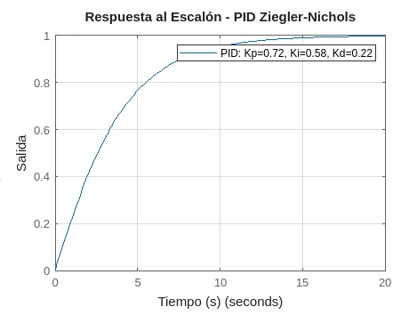
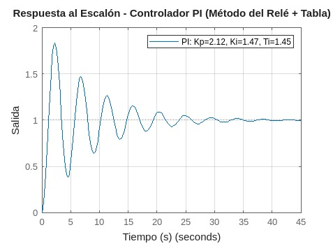
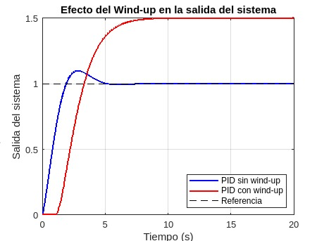
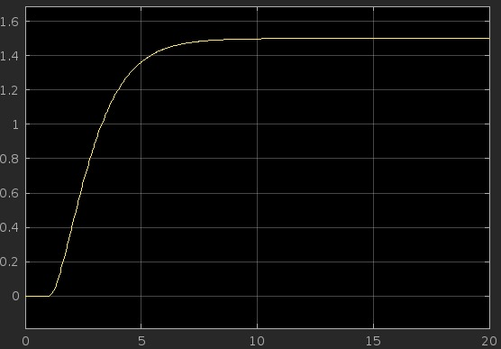

# Controladores PID Lazo Cerrado
Angel David Melo, Daniel Felipe Ladino 

Este informe se centra en el diseño de controladores Proporcional-Integral-Derivativo (PID) en lazo cerrado, una técnica fundamental en sistemas de control. Se abordarán los métodos de sintonización, prestando especial atención al método de Ziegler-Nichols y su mejora, el método del Relé. Además, se explorará el fenómeno del "wind-up" en la acción integral y diversas estrategias "anti-wind-up" para mitigar sus efectos negativos, asegurando un control óptimo y estable en aplicaciones industriales.

## 1. Introducción

El diseño de controladores es un pilar fundamental en la ingeniería de control, permitiendo la automatización de procesos y garantizando su operación eficiente y correcta. Dentro de este campo, los controladores Proporcional-Integral-Derivativo (PID) son ampliamente adoptados por su simplicidad y efectividad en la mejora del comportamiento de los sistemas. Los sistemas de control pueden operar de dos maneras principales: con retroalimentación (lazo cerrado) y sin retroalimentación (lazo abierto).

Este informe se centra en el diseño de controladores PID en lazo cerrado, donde la acción del controlador se ajusta continuamente basándose en la señal de error, que es la diferencia entre el valor deseado (referencia) y el valor medido de la salida del sistema. La sintonización de PID en lazo cerrado implica considerar la dinámica completa del sistema, lo que a menudo requiere pruebas en tiempo real o el uso de modelos precisos para determinar los parámetros óptimos del controlador. En la clase, se explicaron los fundamentos del PID, sus componentes individuales y cómo cada uno afecta el rendimiento del sistema en términos de tiempo de respuesta, oscilaciones, estabilidad y error en estado estacionario. También se abordaron las ventajas y desventajas de los métodos de sintonización en lazo cerrado. A continuación, se detallarán los temas trabajados en la clase, incluyendo los métodos de sintonización de lazo cerrado, el fenómeno del "wind-up" en la acción integral y las estrategias para mitigar sus efectos.

## 2. Definiciones

### 2.1. Lazo Cerrado

> 🔑 *Lazo cerrado:* La idea principal de los métodos de lazo cerrado es identificar los parámetros característicos de la dinámica del sistema realizando pruebas en lazo cerrado. A partir de estas pruebas, se procede al diseño del controlador PID. Un sistema en lazo cerrado utiliza la retroalimentación de la salida del proceso para ajustar la señal de control, permitiendo correcciones automáticas y adaptabilidad a perturbaciones y cambios en la dinámica del sistema.

## 3. Métodos de Sintonización de Controladores PID

### 3.1. Método de Ziegler & Nichols

El método de Ziegler & Nichols es una técnica de sintonización de controladores PID que se basa en la respuesta del sistema en lazo cerrado. Este método es ampliamente utilizado en la industria a pesar de su antigüedad, debido a su simplicidad y efectividad inicial [1].

#### 3.1.1. Método Ziegler & Nichols (Ciclo Último)

La metodología del ciclo último del método de Ziegler & Nichols implica los siguientes pasos [1, 2]:
1.  Llevar las ganancias integral ($K_i$) y derivativa ($K_d$) del controlador PID a cero (0), dejando solo la acción proporcional.
2.  Variar (aumentar gradualmente) la ganancia proporcional ($K_p$) hasta que la salida del sistema se comporte de manera marginalmente estable. Esto se evidencia por oscilaciones sostenidas y de amplitud constante.
3.  Medir el período de la oscilación obtenida en este punto, al cual se le llamará período último ($P_u$).
4.  La ganancia a la cual se logró el estado marginalmente estable se denomina ganancia última ($K_u$).

💡**Ejemplo 1:** Solución analítica para un sistema dado por la función de transferencia $G=\frac{1}{s^{3}+6s^{2}+11s+6}$.

La prueba se realiza en lazo cerrado, por lo tanto, la función de transferencia de lazo cerrado es:

$$G_{o}(s)=\frac{K_{p}G(s)}{1+K_{p}G(s)}=\frac{K_{p}\frac{1}{s^{3}+6s^{2}+11s+6}}{1+K_{p}\frac{1}{s^{3}+6s^{2}+11s+6}}=\frac{K_{p}}{s^{3}+6s^{2}+11s+6+K_{p}}$$

Para obtener las características de la respuesta marginalmente estable, se busca cuando la parte real e imaginaria de la función de transferencia de lazo cerrado son cero (0). Sustituimos $s=j\omega$ en el denominador (ecuación característica):

$$(j\omega)^{3}+6(j\omega)^{2}+11(j\omega)+6+K_{p} = 0$$
$$-j\omega^3 - 6\omega^2 + 11j\omega + 6 + K_{p} = 0$$

Separando la parte real e imaginaria:

$$(-6\omega^2 + 6 + K_{p}) + j(-\omega^3 + 11\omega) = 0$$

Igualamos la parte imaginaria a cero para hallar la frecuencia de oscilación $\omega$:

$$-\omega^{3}+11\omega = 0$$
$$\omega(-\omega^{2}+11) = 0$$
Dado que $\omega \neq 0$ (para una oscilación), tenemos:
$$-\omega^{2}+11=0$$ 
$$\omega^2=11$$ 
$$\omega=\sqrt{11} \text{ rad/s}$$

El período último ($P_u$) se calcula como:

$$P_u=\frac{2\pi}{\omega}=\frac{2\pi}{\sqrt{11}}\approx 1.894~segundos$$

Para obtener la ganancia que produce el estado marginalmente estable ($K_u$), se iguala a cero la parte real:

$$-6\omega^{2}+6+K_{p}=0$$ 
$$K_{p}=6\omega^{2}-6$$ 
Sustituyendo el valor de $\omega^2 = 11$:
$$K_{u}=6(11)-6=66-6=60$$

A continuación, se presenta una tabla con las ecuaciones de diseño para diferentes tipos de controladores PID, utilizando los valores de $K_u$ y $P_u$ obtenidos [1]:

| Tipo | $K_p$ | $T_i$ | $T_d$ |
|---|---|---|---|
| P | $0.5 K_u$ | - | - |
| PI | $0.45 K_u$ | $\frac{P_u}{1.2}$ | - |
| PID | $0.6 K_u$ | $\frac{P_u}{2}$ | $\frac{P_u}{8}$ |

Tabla 1. Ecuaciones de diseño de Ziegler & Nichols para controladores P, PI y PID.

Figura 1. Respuesta marginalmente estable de un sistema en lazo cerrado utilizando el método de Ziegler & Nichols. Esta figura ilustra la oscilación sostenida que permite determinar $P_u$ y $K_u$.

### 3.2. Método del Relé

El método del Relé, también conocido como método de sintonización por retransmisión, es una mejora al método de lazo cerrado de Ziegler & Nichols. Desarrollado por Åström y Hägglund, este método ofrece varias ventajas significativas [3]:
* Evita tener que llevar el sistema a la inestabilidad completa, al inducir una oscilación limitada de manera controlada.
* Se puede manipular la respuesta obtenida durante la prueba, al ajustar las características del relé (ej. histéresis).
* Es un método automático que se puede implementar fácilmente en controladores industriales, reduciendo la necesidad de intervención manual.

La metodología del método del Relé incluye los siguientes pasos [3]:
* Cerrar el lazo utilizando un Relé con histéresis (o sin histéresis ideal) como controlador. El relé induce una oscilación sostenida a la salida del sistema.
* Capturar la forma de onda de la salida, que será una oscilación cuasi-sinusoidal.
* Medir el período de esta oscilación, que corresponde al período último ($P_u$), y la amplitud de la oscilación ($A_u$).
* Determinar la ganancia crítica ($K_c$) a partir de la amplitud de la señal de control del relé ($d$) y la amplitud de la oscilación de la salida ($A_u$).

La ganancia crítica $K_c$ se puede determinar utilizando la siguiente ecuación, donde $d$ es la amplitud de la señal de salida del relé y $A_u$ es la amplitud de la oscilación obtenida [3]:

$$K_c = \frac{4d}{\pi A_u}$$
(Si el relé tiene histéresis $\epsilon$, la fórmula más precisa es $K_c = \frac{4d}{\pi \sqrt{A_u^2 - \epsilon^2}}$)

Es importante que la oscilación se produzca con un desfase de aproximadamente $180^\circ$ entre la entrada del relé y la salida del proceso, indicando que el sistema está oscilando en su frecuencia crítica.

La sintonización PI utilizando el método del Relé a menudo emplea ecuaciones basadas en las de Ziegler & Nichols, buscando un máximo sobreimpulso menor al 10%. Las ecuaciones para el controlador PI son [3]:

| Controlador | $K_p$ | $T_i$ |
|---|---|---|
| PI | $\frac{5K_c}{6}$ | $\frac{P_u}{5} \frac{1+12K_c/15}{1+4K_c/15}$ |

Tabla 2. Sintonización PI con el método del Relé (reglas de Åström y Hägglund).

Figura 2. Oscilación sostenida obtenida en lazo cerrado con el controlador tipo relé para la determinación de $P_u$ y $A_u$.

## 4. Fenómeno Wind-up y Estrategias Anti Wind-up

### 4.1. Fenómeno Wind-up

El fenómeno "wind-up" (también conocido como "integrator wind-up" o "reset wind-up") es un problema común en los controladores PID, particularmente con la acción integral. Ocurre cuando la señal de control calculada por el controlador supera los límites de saturación de la salida del actuador (por ejemplo, una válvula que solo puede abrirse entre 0% y 100%). Cuando esto sucede, el término integral del controlador continúa acumulándose, incluso si la salida real del actuador ya está en su límite [6].

Cuando la acción integral sigue acumulándose más allá de los límites físicos del actuador, los tiempos de respuesta del sistema se ven afectados negativamente. Esto se debe a que, una vez que el error cambia de signo o la referencia se ajusta para volver a un valor controlable, el término integral debe "desacumularse" (o "desenrollarse") hasta que la señal de control caiga dentro de los límites operativos del actuador antes de que la salida del proceso pueda empezar a responder eficazmente. Esta acumulación excesiva puede causar un gran sobreimpulso o un tiempo de asentamiento prolongado cuando la señal de control finalmente vuelve a estar dentro de los límites del actuador [6].

### 4.2. Estrategias Anti Wind-up

Para mitigar el fenómeno del "wind-up", se han desarrollado diversas estrategias "anti wind-up", las cuales buscan limitar la acumulación del término integral o ajustarlo cuando el actuador está saturado [7].

#### 4.2.1. Anti Wind-up por Saturación de la Acción Integral

Esta estrategia implica limitar directamente la acumulación de la acción integral, deteniendo la integración cuando la señal de control alcance los límites de saturación. Es una de las formas más simples de implementar. Aunque protege al actuador de recibir señales fuera de su rango, el término integral puede aún ser sub-óptimo para un rápido regreso al punto de operación, ya que simplemente detiene la acumulación sin ajustar el valor acumulado [7].

#### 4.2.2. Anti Wind-up por Integración Condicional

En esta estrategia, la integración de la acción integral se suspende (o se "congela") cuando la salida del actuador alcanza sus límites de saturación y el error tiene el mismo signo que la saturación. Esto significa que el término integral solo se actualiza cuando el actuador no está saturado o cuando el error tiene el signo opuesto a la saturación actual. Esta técnica ayuda a solucionar el problema del tiempo de respuesta del sistema, pero en algunos casos, la suspensión abrupta de la acción integral puede producir algunos pulsos o "jerks" no deseados en la respuesta del sistema [8].

#### 4.2.3. Anti Wind-up por Recálculo y Seguimiento (Tracking Anti-Wind-up)

Esta es una de las estrategias más avanzadas y efectivas. Consiste en realimentar la diferencia entre la salida saturada y la salida no saturada del controlador al integrador, a través de una ganancia de seguimiento ($K_t$ o $1/T_t$). Cuando la señal de control calculada por el PID excede los límites del actuador, el término integral se ajusta de tal manera que la salida del controlador "siga" la salida real del actuador. Esto permite que el integrador se "desenrolle" de forma más suave y predictiva cuando el actuador está saturado. La ganancia $T_t$ (o $1/K_t$) definirá la velocidad de respuesta del "anti wind-up", donde típicamente $T_t = T_i$ o $T_t = \sqrt{T_i T_d}$ para un comportamiento óptimo [9, 10]. Esta estrategia proporciona una transición más suave y un mejor rendimiento general del sistema.

Figura 3. Comparación de la respuesta del sistema con un controlador PID sin estrategia anti-wind-up frente a la respuesta con "wind-up" activo, mostrando el sobreimpulso excesivo.

Figura 4. Comparación de la efectividad de diferentes estrategias "anti-wind-up" (saturación, integración condicional, y seguimiento) en la respuesta de un sistema PID saturado.

## 5. Ejercicios

📚**Ejercicio 1:** Dado un sistema con función de transferencia $G(s)=\frac{1}{s^{3}+10s^{2}+27s+18}$, determine la ganancia última $K_u$ y el período último $P_u$ utilizando el método de Ziegler & Nichols (ciclo último).

**Solución:**

La función de transferencia en lazo cerrado es:
$$G_{o}(s)=\frac{K_{p}G(s)}{1+K_{p}G(s)}=\frac{K_{p}\frac{1}{s^{3}+10s^{2}+27s+18}}{1+K_{p}\frac{1}{s^{3}+10s^{2}+27s+18}}=\frac{K_{p}}{s^{3}+10s^{2}+27s+18+K_{p}}$$

Para encontrar $K_u$ y $P_u$, analizamos la ecuación característica (denominador de $G_o(s)$) para condiciones de oscilación sostenida, sustituyendo $s=j\omega$:
$$(j\omega)^{3}+10(j\omega)^{2}+27(j\omega)+18+K_{p}=0$$
$$-j\omega^{3}-10\omega^{2}+27j\omega+18+K_{p}=0$$

Separamos la parte real e imaginaria:
$$(-10\omega^{2}+18+K_{p}) + j(-\omega^{3}+27\omega) = 0$$

Igualamos la parte imaginaria a cero para hallar la frecuencia de oscilación $\omega$:
$$-\omega^{3}+27\omega = 0$$
$$\omega(-\omega^{2}+27) = 0$$
Como $\omega \neq 0$ para una oscilación:
$$-\omega^{2}+27=0$$
$$\omega^{2}=27$$
$$\omega=\sqrt{27} \approx 5.196 \text{ rad/s}$$

Calculamos el período último $P_u$:
$$P_u = \frac{2\pi}{\omega} = \frac{2\pi}{\sqrt{27}} \approx \frac{6.283}{5.196} \approx 1.209 \text{ segundos}$$

Igualamos la parte real a cero para obtener la ganancia última $K_u$:
$$-10\omega^{2}+18+K_{p}=0$$
$$K_{p}=10\omega^{2}-18$$
Sustituyendo $\omega^2=27$:
$$K_{u}=10(27)-18 = 270-18 = 252$$

Por lo tanto, la ganancia última es $K_u = 252$ y el período último es $P_u \approx 1.209$ segundos.

📚**Ejercicio 2:** Utilizando los valores de $K_u=252$ y $P_u=1.209$ segundos obtenidos en el Ejercicio 1, calcule los parámetros $K_p$, $T_i$ y $T_d$ para un controlador PID según las ecuaciones de diseño de Ziegler & Nichols.

**Solución:**

Para un controlador PID, las ecuaciones de diseño de Ziegler & Nichols (Tabla 1) son:

$K_p = 0.6 K_u$
$T_i = \frac{P_u}{2}$
$T_d = \frac{P_u}{8}$

Sustituyendo los valores calculados de $K_u$ y $P_u$:

$K_p = 0.6 \times 252 = 151.2$
$T_i = \frac{1.209}{2} = 0.6045 \text{ segundos}$
$T_d = \frac{1.209}{8} = 0.151125 \text{ segundos}$

Por lo tanto, los parámetros para el controlador PID sintonizado con Ziegler & Nichols son: $K_p = 151.2$, $T_i = 0.6045$ segundos y $T_d = 0.151125$ segundos.

## 6. Conclusiones

El diseño de controladores PID en lazo cerrado representa una piedra angular en la ingeniería de control, ofreciendo una solución robusta y versátil para la automatización y optimización de sistemas dinámicos en una amplia gama de aplicaciones industriales y científicas. Los métodos de sintonización en lazo cerrado, como el clásico de Ziegler & Nichols basado en el ciclo último, y el más moderno método del Relé, proporcionan enfoques sistemáticos y prácticos para la determinación de los parámetros del controlador ($K_p$, $T_i$, $T_d$). Mientras que Ziegler & Nichols, a pesar de su simplicidad y antigüedad, sigue siendo un punto de partida válido para obtener una sintonización inicial, el método del Relé ofrece ventajas significativas al permitir pruebas en condiciones más controladas, induciendo oscilaciones limitadas y facilitando la automatización del proceso de sintonización en entornos industriales. La capacidad de estos métodos para extraer información crítica sobre la dinámica del proceso a partir de pruebas de lazo cerrado es invaluable.

Sin embargo, la implementación práctica de controladores PID en lazo cerrado no está exenta de desafíos. Un problema recurrente y crítico es el fenómeno del "wind-up" en la acción integral. Esta acumulación excesiva del término integral, cuando la salida del actuador alcanza sus límites de saturación, puede llevar a un rendimiento deficiente del sistema, manifestado en sobreimpulsos excesivos y largos tiempos de asentamiento una vez que la saturación se revierte. Para mitigar estos efectos perjudiciales, la incorporación de estrategias "anti-wind-up" es imperativa. Soluciones como la saturación del integrador, la integración condicional o, de manera más sofisticada, el anti-wind-up por recálculo y seguimiento, son fundamentales para asegurar que el controlador opere de manera eficiente, manteniendo la señal de control dentro de los límites operativos del actuador y garantizando una respuesta suave y controlada del sistema frente a cambios de referencia y perturbaciones. La elección y aplicación correcta de estas estrategias son determinantes para la robustez y fiabilidad del sistema de control en lazo cerrado en condiciones operativas reales.

## 7. Referencias

* [1] Ziegler, J. G., & Nichols, N. B. (1942). Optimum settings for automatic controllers. *Transactions of the ASME*, 64(11), 759-768.
* [2] Ogata, K. (2010). *Ingeniería de control moderna* (5ta ed.). Pearson Education. (Capítulo 10: Diseño de sistemas de control PID).
* [3] Astrom, K. J., & Hagglund, T. (2006). *Advanced PID control*. ISA-The Instrumentation, Systems, and Automation Society. (Capítulo 3: PID Controller Design).
