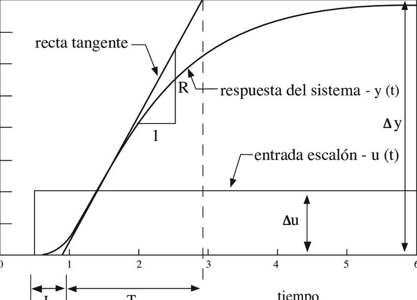
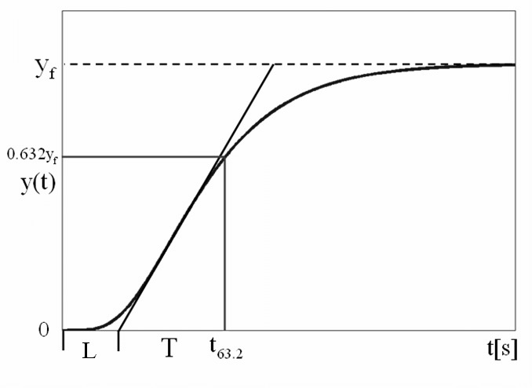
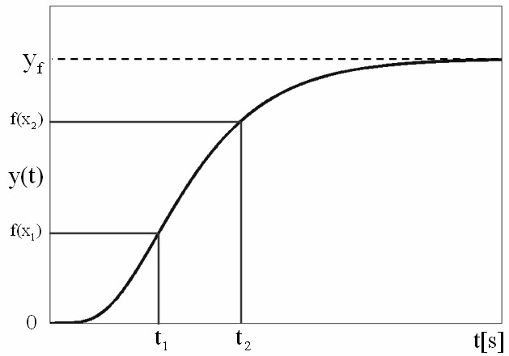

# Identificacion de sistemas por curva de reaccion
Para poder sintonizar cualquier controlador se debe tener en cuenta los siguientes metodos:

-Modelo matematico

-Curvas de reaccion en lazo abierto

-Identificacion de parametros en lazo abierto

-Analisis de frecuencia

-Tecnicas de inteligencia computacional

## Procedimiento de sintonizacion 
Para diseñar cualquier controlador se requiere conocer el comportamiento de la planta, esto para escoger los parametros del sistema y para esto hay metodologias que permiten obtener un modelo aproximado.
## Metodologias de tipo empirico
Estas metodologias permiten obtener modelos de comportamiento a partir de pruebas realizadas sobre la planta involucrando manejo de datos, estadistica y señales.
## Metodologias de identificacion de lazo abierto
Este metodo permite obtener un modelo de primer orden y adicionalmente el tiempo muerto. Su formula caracteristica es:

$$ G(s)=\frac{ke^{-st_{0}}}{\tau s+1}$$

Donde $\tau$ es contante de tiempo del sistema, k es ganancia estatica del sistema y t_{0} es tiempo muerto.

## Aplicacion curvas de reaccion en lazo abierto
Para utilizar este metodo se debe tener en cuenta las siguientes condiciones.
El sistema debe ser estable en lazo abierto, Tambien debe tener un comportamiento sobre o criticamente amortiguado.
Este procedimiento consiste en la aplicacion de una señal de tipo escalon y capturar los datos obtenidos.
## Metodo de Ziegler y Nichols

Son metodos muy antiguos utilizados en los tiempos en donde no se tenian ayudas computacionales. Teniendo esto en cuenta este metodo permitia evadir el modelamiento matematico riguroso.
La recta tangente se traza al punto de inflexion de la curva y sus ecuaciones son:

$t_{m}$=cruce de la recta tangente con el eje del tiempo

$$K=\frac{\Delta y}{\Delta u}$$
## Metodo modificado de miller

El proposito de miller con este metodo es hacer el proceso mas repetible
La recta tangente se traza de la misma manera y con esto se hayara el tiempo muerto. Ademas, la constante de tiempo se identificara a partir de un valor fijo de la grafica.
Sus ecuaciones son:

$t_{m}$=cruce de la recta tangente con el eje del tiempo

$$\tau =\tau '-t_{m}$$

$$K=\frac{\Delta y}{\Delta u}$$

Como se puede observan son las mismas que en el anterior metodo con la diferencia que se agrega la ecuacion de $\tau$
# Metodos de identificacion de dos puntos

Este metodo permite una mejor representacion de la respuesta del modelo debido a los dos puntos de referencia.
## Lazo abierto
Algunos sistemas inestables se pueden indentificar en lazo abierto. El modelo obenido es aproximado y el error es asumido por el controlador
Sus ecauciones son:

$$\tau =At_{1}+Bt_{2}$$

$$t_{o}=Ct_{1}+Dt_{2}$$

$$K=\frac{\Delta y}{\Delta u}$$

## Ejemplo en clase
Se tiene la siguiente señal:

El valor final es 2 por lo que:

$$P_{2}=2(0.632)=1.2604$$

$$P_{1}=2(0.283)=0.566$$

Teniendo esto en cuenta se llega a los siguientes resultados:

En la grafica se ubican los dos puntos:

Se obtienen los parametros:

$$\tau =(-1.5)(1.67)+(1.5)(2.89)=1.83 seg$$

$$t_{0} =(1.5)(1.67)+(-0.5)(2.89)=1.06 seg$$

$$K=\frac{2-0}{1-0}=2$$

$$G(s)=2\cdot \frac{e^{-1.06s}}{1.83s+1}$$

finalmente obtenemos la grafica resultante:

## Aproximacion FOPDTI
El modelo matematico para aproximar segun este metodo es:

$$G=\frac{ke^{-st_{0}}}{(\tau s+1)s}$$

La metodologia de este metodo es la siguiente, se captura la curva de reaccion de lazo abierto, se deriva la curva obtenida por metodo numerico o usando simulacion y el resultado se aproxima a primer orden mas el tiempo muerto

## Aproximacion IPDT
El modelo que se utiliza para para aproximar es:

$$G=\frac{Ke^{-st_{o}}}{s}$$

Para este metodo la metodologia se basa en:
1. se captura la curva de reaccion en lazo abierto
2. Se ubican los puntos caracteristicos de la curva obtenida
3. Se calculan los parametros K t $T_{o}$
