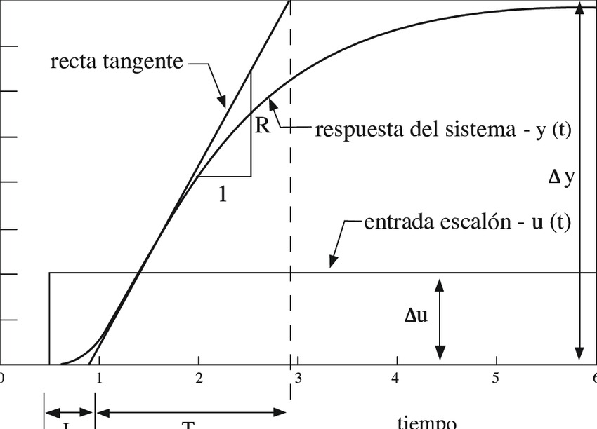
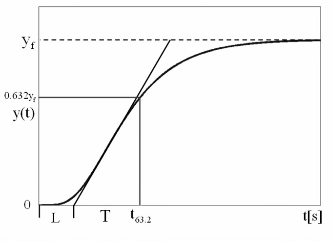
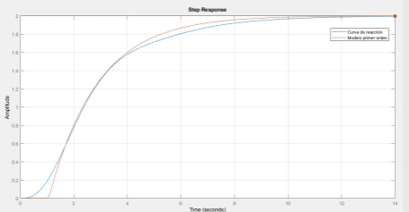

# Identificacion de sistemas por curva de reaccion
Angel David Melo, Daniel Felipe Ladino

La identificación de sistemas es un proceso fundamental en el control automático, consiste en determinar un modelo matemático que describa el comportamiento dinámico de un sistema físico a partir de datos experimentales.
Algunos de los métodos de identificación más usados son los siguientes:

-Modelo matematico

-Curvas de reaccion en lazo abierto

-Identificacion de parametros en lazo abierto

-Analisis de frecuencia

-Tecnicas de inteligencia computacional

## Procedimiento de sintonizacion 
Para diseñar cualquier controlador se requiere conocer el comportamiento de la planta, esto para escoger los parámetros del sistema y para esto hay metodologías que permiten obtener un modelo aproximado.

La sintonización es un proceso critico de control automático para garantizar que un sistema responda de manera óptima a cambios en la referencia o perturbaciones.

## Metodologias de tipo empirico
Estas metodologias permiten obtener modelos de comportamiento a partir de pruebas realizadas sobre la planta involucrando manejo de datos, estadistica y señales.
## Metodologias de identificacion de lazo abierto
Este metodo permite obtener un modelo de primer orden y adicionalmente el tiempo muerto. Su formula caracteristica es:

$$ G(s)=\frac{ke^{-st_{0}}}{\tau s+1}$$

Donde $\tau$ es contante de tiempo del sistema, k es ganancia estatica del sistema y t_{0} es tiempo muerto.

## Aplicacion curvas de reaccion en lazo abierto
Para utilizar este metodo se debe tener en cuenta las siguientes condiciones.
El sistema debe ser estable en lazo abierto, Tambien debe tener un comportamiento sobre o criticamente amortiguado.
Este procedimiento consiste en la aplicacion de una señal de tipo escalon y capturar los datos obtenidos.
## Metodo de Ziegler y Nichols

Son metodos muy antiguos utilizados en los tiempos en donde no se tenian ayudas computacionales. Teniendo esto en cuenta este metodo permitia evadir el modelamiento matematico riguroso.
La recta tangente se traza al punto de inflexion de la curva y sus ecuaciones son:

$t_{m}$=cruce de la recta tangente con el eje del tiempo

$$K=\frac{\Delta y}{\Delta u}$$
## Metodo modificado de miller

El proposito de miller con este metodo es hacer el proceso mas repetible
La recta tangente se traza de la misma manera y con esto se hayara el tiempo muerto. Ademas, la constante de tiempo se identificara a partir de un valor fijo de la grafica.
Sus ecuaciones son:

$t_{m}$=cruce de la recta tangente con el eje del tiempo

$$\tau =\tau '-t_{m}$$

$$K=\frac{\Delta y}{\Delta u}$$

Como se puede observan son las mismas que en el anterior metodo con la diferencia que se agrega la ecuacion de $\tau$
# Metodos de identificacion de dos puntos

Este metodo permite una mejor representacion de la respuesta del modelo debido a los dos puntos de referencia.
## Lazo abierto
Algunos sistemas inestables se pueden indentificar en lazo abierto. El modelo obenido es aproximado y el error es asumido por el controlador
Sus ecauciones son:

$$\tau =At_{1}+Bt_{2}$$

$$t_{o}=Ct_{1}+Dt_{2}$$

$$K=\frac{\Delta y}{\Delta u}$$
## Constantes
Las constantes que se utilizaran seran las siguientes:

| Método         | %P₁ (t₁) | %P₂ (t₂) | A      | b      | c      | d      |
|----------------|-----------|-----------|--------|--------|--------|--------|
| Alfaro         | 250       | 75.0      | -0.910 | 0.910  | 1.262  | -0.262 |
| Bröida         | 28.0      | 40.0      | -5.500 | 5.500  | 2.800  | -1.800 |
| Chen y Yang    | 33.0      | 67.0      | -1.400 | 1.400  | 1.540  | -0.540 |
| Ho *et al.*    | 35.0      | 85.0      | -0.670 | 0.670  | 1.300  | -0.290 |
| Smith          | 28.3      | 63.2      | -1.500 | 1.500  | 1.500  | -0.500 |

## Ejemplo en clase
Se tiene la siguiente señal:

Teniendo esto en cuenta se llega a los siguientes resultados:

| Método Smith | A    | B    | C    | D    |
|--------------|------|------|------|------|
| P2 = 63.2 %  | -1.5 | 1.5  | 1.5  | -0.5 |
| P1 = 28.3 %  | -1.5 | 1.5  | 1.5  | -0.5 |

El valor final es 2 por lo que:

$$P_{2}=2(0.632)=1.2604$$

$$P_{1}=2(0.283)=0.566$$

En la grafica se ubican los dos puntos:

Se obtienen los parametros:

$$\tau =(-1.5)(1.67)+(1.5)(2.89)=1.83 seg$$

$$t_{0} =(1.5)(1.67)+(-0.5)(2.89)=1.06 seg$$

$$K=\frac{2-0}{1-0}=2$$

$$G(s)=2\cdot \frac{e^{-1.06s}}{1.83s+1}$$

finalmente obtenemos la grafica resultante:

## Metodo de 2 puntos en segundo orden
Este metodo tambien es efectivo con los sistemas de segundo orden. Su aplicacion es igual pero se cambian las constantes.

| Método                       | A      | B      | C      | D      |
|-----------------------------|--------|--------|--------|--------|
| Ho   P2 = 85%   P1 = 35%      | -0.463 | 0.463  | 1.574  | -0.574 |
| Viteckova   P2 = 70%   P1 = 33% | -0.749 | 0.749  | 1.937  | -0.937 |

Ademas se tienen las siguientes formulas:

$$\tau =At_{1}+Bt_{2}$$

$$t_{o}=Ct_{1}+Dt_{2}$$

$$K=\frac{\Delta y}{\Delta u}$$

$$G(s)=\frac{ke^{-t_{o}s}}{(\tau s+1)(\tau s+1)}$$

## Aproximacion FOPDTI
El modelo matematico para aproximar segun este metodo es:

$$G=\frac{ke^{-st_{0}}}{(\tau s+1)s}$$

La metodologia de este metodo es la siguiente, se captura la curva de reaccion de lazo abierto, se deriva la curva obtenida por metodo numerico o usando simulacion y el resultado se aproxima a primer orden mas el tiempo muerto

## Aproximacion IPDT
El modelo que se utiliza para para aproximar es:

$$G=\frac{Ke^{-st_{o}}}{s}$$

Para este metodo la metodologia se basa en:
1. se captura la curva de reaccion en lazo abierto
2. Se ubican los puntos caracteristicos de la curva obtenida
3. Se calculan los parametros K t $T_{o}$

# Ejercicios
1. Se tiene la siguiente señal

Podemos ver una respuesta al escalon de un sistema de primer orden.
De la grafica podemos sacar los siguientes datos:

1. $A=2$
2. el sistema se eleva alrededor de los $t_{i}=5 seg$, entonces $L=5s$
3. t=33 seg
4. T=33-5=28 seg
Con estos datos nos disponemos a realizar los siguientes calculos:

$$K_{p}=1.2\frac{T}{L}=1.2\frac{28}{5}=6.72$$

$$ T_{i}=2L=2(5)=10 seg$$

$$T_{d}=0.5L=0.5(5)=2.5 seg$$

2. Tenemos la siguiente señal. Tenga en cuenta que el sistema tiene una ganancia de oscilacion sostenida de $k_{u}=4.5$ y una oscilacion sostenida de $T_{u}=2 seg$ 

Como se puede ver tenemos una señal que representa una respuesta al escalon de un sistema de segundo orden submamortiguado.
Viendo el diagrama podemos sacar los siguientes datos:

1. tiempo de estabilizacion: $t_{s}=3.3 seg$
2. tiempo pico: $t_{p}:1.1 seg$
3. la señal se estabiliza en 2

Teniendo estos datos en cuenta nos disponemos a realizar los calculos:

$$K_{p}=0.6K_{u}=0.6(4.5)=2.7$$

$$T_{i}=\frac{T_{u}}{2}=\frac{2}{2}=1 seg$$

$$T_{i}=\frac{T_{u}}{8}=\frac{2}{8}=0.25 seg$$
